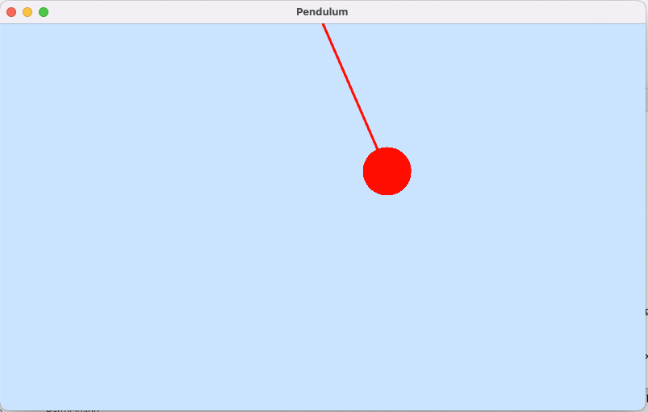

# Rusty Pendulum

An application in Rust to study gravity in a pendulum.

## Overview

The idea is to simulate the pendulum of Chrono Tiger. Code based on the YouTube video: [Link](https://www.youtube.com/watch?v=U-X51GsTAzA&t=1633s&pp=ygUMUnVzdCBQZW5kdWxv)

## How to Use

Install Rust with Cargo. See the [docs](https://www.rust-lang.org/tools/install).

After install, nagivate to the `/src` folder and run command: `cargo run`. This command will downloaded all requirements from pendulum application.

To deploy for production, plase, run the command: `cargo build`. So you can get the production version.

## License

Free

## Author

Vinicius Rosa - Maintainer

## Screenshot

